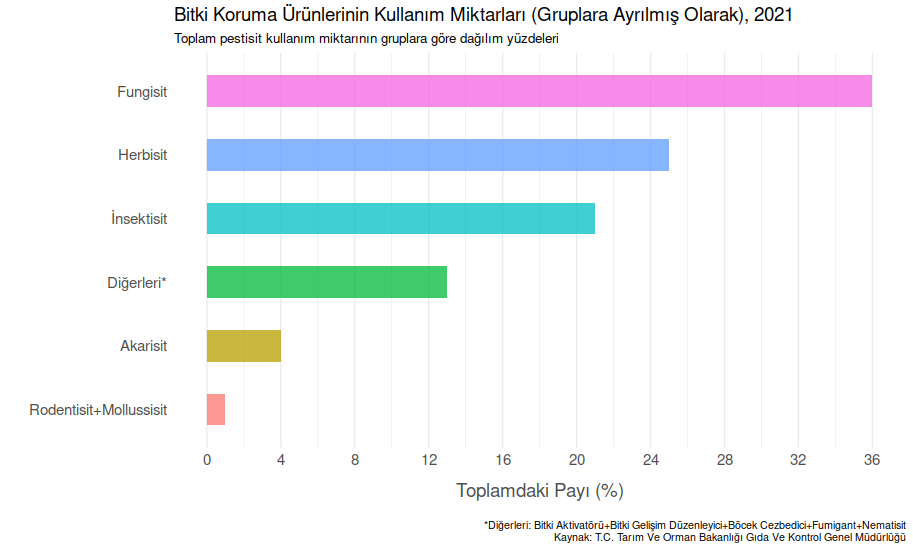

## Plot 1A

## Plot 1B

## Plot 2A

## Plot 2B

### Sources:
- [Official Pesticide Statistics](https://www.tarimorman.gov.tr/GKGM/Menu/115/Resmi-Tarimsal-Ilac-Istatistikleri)
- [The Usage Amount of Plant Protection Products (By Grouping) By Years, 2006-2021](https://www.tarimorman.gov.tr/GKGM/Belgeler/DB_Bitki_Koruma_Urunleri/Istatistik/Yillar_Itibariyla_BKU_Kullanim_Miktar_2006-2021.pdf)
- [Amounts of Use of Plant Protection Products at Provincial Level (in Agricultural Control Practices), 2021](https://www.tarimorman.gov.tr/GKGM/Belgeler/DB_Bitki_Koruma_Urunleri/Istatistik/Il_Duzeyinde_BKU_Kullanim_Miktar_2021.pdf)
